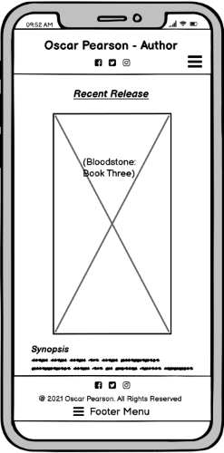

<h1 align="center">Oscar Pearson - Author</h1>

## About

Project - User-Centric Frontend Development - Code Institute

The purpose of this project is to provide a website for the fans and readers of author Oscar Pearson.

It will serve as a focal point for all things relating to the author, allowing people interested in his works to discover more about the author and his published works.
The aim is to help the author to market his novels, guide his audience to his social media platforms and keep fans updated on newly published works, as well as works in progress.

## Deployment

A link to the website can be found [here] INSERT ACTUAL LINK HERE!!!!!!!!!!!!!!!!!

ADD WIREFRAME IMAGES OR IMAGE OF WEBSITE LANDING PAGE HERE!!!!!!!!!!!!!!!!!!

## Table of Contents

[User Experience (UX)](#UX)

[Features](#features)

[Technologies Used](#technologies)

[Testing](#testing)

[Deployment](#deployment)

[Known Bugs](#bugs)

[Credits](#credits)

## User Experience (UX)

The end user of this project will be fans and prospective fans of author Oscar Pearson.

It is aimed at readers of fantasy novels, specifically readers of the sub-genre 'grimdark' fantasy as this is the type of fiction that Oscar Perason writes.

### User Stories

* As a user I want to be able to view and purchase Oscar Pearson's latest releases.
* As a user I want to be able to view and purchase Oscar Pearson's past published works.
* As a user I want to be shown how to easily follow the author on social media platforms.
* As a user I want to find out more about the author Oscar Pearson's life.
* As a user I want to be able to read a brief synopsis of each book to get a feel for their stories.
* As a user I want to be able to navigate the site easily whether accessing through my mobile or laptop.
* As a user I want to be able to view any events the author is attending eg. signing, interviews etc.
* As a user I want to be able to get in touch to ask questions about upcoming events.

### Design

- ####    Colour Scheme
    - The colours used for the website were chosen in an attempt to pull the user into the dark fantasy worlds created by the author; worlds where darkness is prevelant and the grey steel of swords and spears rules. 
    I have therefor chosen a base color of black with a secondary grey color (#85898c). It is my hope that these basic colours will also work well to not clash with the different colours of the author's book covers displayed on the website.
    Ruby Red (#a3001e) is adde throughout for that hint of blood and feeling of danger.

        

- ####    Typography
    - The main font I have chosen is 'Roboto' It is easy to read, stands out and will hopefully remind users of an easy to read book. I will use sans-serif as a backup font.

    - The secondary font used is 'PT Serif' to help headings and titles to stand out from the rest of the text.

    - 'Crimson+Text' was added to the main text for the synopsis, quotes and bio sections to make the longer paragraphs more stylish and exciting to read.

- ####    Images
    - The main use of images for this website will be the ones used for book covers. As none of the books on the website are real I have taken some images from (https://www.pexels.com/) and added some text over them for the Author's name and Book Title.

    - An image of faded parchment - also from (https://www.pexels.com/) - such as might have been used for maps in ancient times, was used for the background of the pages sections. Again this is used to draw the user into the authors fantastical worlds.

    - Other images constist of small icon images taken from (https://fontawesome.com/v4.7/) to add imagery to help convey meaning to heading and make them more fun.

- #### Wireframes
    - All wireframes were made using Balsamiq. I have left up my original wireframes to show how the project changed shape as I worked through it.
    
    - Mobile Wireframe

        

    - Home Page Wireframe

        

## Features

### Common Features

* Header - provides users with easy navigation throughout the webpage.
    - The header is positioned using Bootsraps 'sticky-top' class. This keeps the navigation always within easy reach for the user.
    - The navigation menu is positioned in the header because this is the most common location for it meaning the user will know exactly where to find it.
    - Whichever page the user is currenlty on among the website will be underlined with a red line to show the user exactly where they are.
    - The header title is the Author's name, Oscar Pearson, this is here to instantly reasure fans of the author that they are on the right page for all of his content.
    - Colors were chosen to represent the fantasy author's dark world where powers lies with the strong. The black signifies the dark world and the colour grey of the writing is for the steel of swords and other weaponry.
* Links/Buttons - Any links hovered over will respond.
    - The page navigation links in the header will change colour to a paler version of themselves.
    - The social media images will also change to a plaer version to indicate they are links.
    - The background of the 'Buy Now' buttons will darken slightly when hovered over.
* Writing Progress
    - This feature is in place to provide the page user with up an update progress report for each of Oscar Pearson's upcoming projects. Thus keeping the user enticed and making it likely that they will return in the future to see how favoured book series are coming along.
    - This feature was made using Bootstrap's 'progress-bar', allowing me to change the colouring to suit the page.
* Accessibility
    - The hamburger menu initiated for smaller screens, has aria-label added to let users with screen readers know where the toggleable menu is.
    - Each progress-bar also has aria-label added so users with screen readers will be informed of the progress of selected upcoming projects.
* Hero-image
    - The background hero image is that of old, worn looking parchment meant to convey to the user the feeling that they are once again within Oscar Pearson's fantasy world.
* Footer
    - The footer has been designed to mirror the header by way of its colour scheme, though a dash of red has been thrown in for the Policy buttons.
    - The author's social media links take center stage of the footer to once again encourage the user to check out the author's social media content and stay within easy reach of all things Oscar Pearson.

### Specific Features

* Landing Page
    - The first thing the user is introduced to the Oscar Pearson's latest release, showing the book cover along side a synopsis of the story, quotes from fellow authors and a button link to allow them to purchase the novel.
* Books
    - Similiarly set up to the main Landing page, the Books page consists of previous titles published by the author, allowing users to peruse Oscar's past novels and purchase as they please.
* Events
    - The events page consists of Bootstrap's 'table' class to inform user's of public events Oscar Pearson will be speaking on or attending by laying out clear information as to where and when they will take place.
* Bio
    - The Bio page constists of two halves detailing his life from before he became an author to how he became one and thereafter.
* Contact
    - The contact page provides a simples to use and understand form requesting basic information from any users who wish to get into contact with the Author.

### Prospective Features
-   Creat a space for users to comment on books and engage in discussion on the site about the books and their fantasy worlds.

### Technologies Used

### Languages Used

    - HTML5
    - CSS3

### Frameworks, Libraries & Programs Used

* [Bootstrap v4.2.1 & v4.7.0](https://getbootstrap.com/)
* [Font Awesome](https://fontawesome.com/) - Font Awesome was used to add social icons and complement the design.
* [Google Fonts](https://fonts.google.com/) - Google Fonts was used to import 'Roboto' and 'PT Sarif' fonts in the main.css stylesheet.
* [Git](https://git-scm.com/) - Git was used for version control by utilizing the Gitpod terminal to commit to Git and Push to GitHub.
* [GitHub:](https://github.com/) - GitHub is used to store the projects code after being pushed from Git.
* [GitPod](https://www.gitpod.io/) - GitPod, connected to GitHub, hosted the coding space and allowed the projected to be committed to the Github repository.
* [Balsamiq](https://balsamiq.com/) - Balsamiq was used to create the [wireframes].
* [Paint 3D](https://balsamiq.com/) - Microsoft app Paint 3D was used to edit some of the images for the book covers.
* [jquery v3.5.1](https://getbootstrap.com/) - retrieved from a bootstrap example to assist with my navigation toggler.
* [popper.js/1.16.0] (https://getbootstrap.com/) - retrieved from a bootstrap example to assist with my navigation toggler.
* [Chrome DevTools](https://developer.chrome.com/docs/devtools/) for constant debugging and checking of features.

## Testing

### Testing User Stories

### Further Testing

### Known Bugs

## Deployment

### Github Pages

### Forking the Github Repository

### Making a Local Clone

## Credits

* [pexels](https://pexels.com/) - images for books covers taken from this site.

### Code

### Content

*   All content was written by the developer.

### Media
* Animated mock profile image of Oscar Pearson provided by (https://dribbble.com/Setya182)
* Parchment hero-image and book cover for Bloodstone: Book Two on the 'Books' page provided by pixabay.com at (https://www.pexels.com/@pixabay)
* Book cover for Bloodstone: Book Three on the main landing page is by (https://www.pexels.com/@pedro-figueras-202443)
* Book cover for Confused Worship on the 'Books' page provided by (https://www.pexels.com/@monatrms)

### Acknowledgements